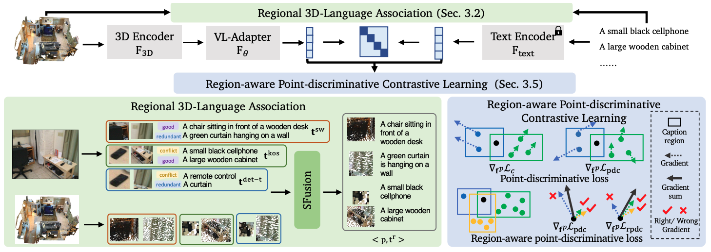

<div align="center">

<h1>PLA: Language-Driven Open-Vocabulary 3D Scene Understanding</h1>

<div>
    <a href="https://dingry.github.io/" target="_blank">Runyu Ding</a><sup>1*</sup>,</span>
    <a href="https://jihanyang.github.io/" target="_blank">Jihan Yang</a><sup>1*</sup>,</span>
    <a href="https://scholar.google.com/citations?user=KJU5YRYAAAAJ&hl=en" target="_blank">Chuhui Xue</a><sup>2</sup>,</span>
    <a href="https://github.com/HannibalAPE" target="_blank">Wenqing Zhang</a><sup>2</sup>,</span>
    <a href="https://songbai.site/" target="_blank">Song Bai</a><sup>2&#8224</sup>,</span>
    <a href="https://xjqi.github.io/" target="_blank">Xiaojuan Qi</a><sup>1&#8224</sup>,</span>  
</div>

<div>
    <sup>1</sup>The University of Hong Kong&emsp;
    <sup>2</sup>ByteDance
</div>

<div>
    *equal contribution&emsp;
    <sup>+</sup>corresponding author
</div>

**CVPR 2023**

TL;DR: PLA leverages powerful VL foundation models to construct hierarchical 3D-text pairs for 3D open-world learning.

<table>
<tr>
    <td></td>
    <td></td>
    <td></td>
</tr>
<tr>
    <td align='center' width='24%'>working space</td>
    <td align='center' width='24%'>piano</td>
    <td align='center' width='24%'>vending machine</td>
<tr>
</table>


<!-- 
-->


[project page](https://dingry.github.io/projects/PLA) | [arXiv](https://arxiv.org/abs/2211.16312)

</div>

### TODO
- [ ] Release caption processing code

### Getting Started

#### Installation
Please refer to [INSTALL.md](docs/INSTALL.md) for the installation.

#### Dataset Preparation
Please refer to [DATASET.md](docs/DATASET.md) for dataset preparation.

#### Training & Inference

Please refer to [MODEL.md](docs/MODEL.md) for training and inference scripts and pretrained models.


### Citation
If you find this project useful in your research, please consider cite:
```bibtex
@inproceedings{ding2022language,
    title={PLA: Language-Driven Open-Vocabulary 3D Scene Understanding},
    author={Ding, Runyu and Yang, Jihan and Xue, Chuhui and Zhang, Wenqing and Bai, Song and Qi, Xiaojuan},
    booktitle={Proceedings of the IEEE/CVF Conference on Computer Vision and Pattern Recognition},
    year={2023}
}
```

### Acknowledgement
Code is partly borrowed from [OpenPCDet](https://github.com/open-mmlab/OpenPCDet), [PointGroup](https://github.com/dvlab-research/PointGroup) and [SoftGroup](https://github.com/thangvubk/SoftGroup).